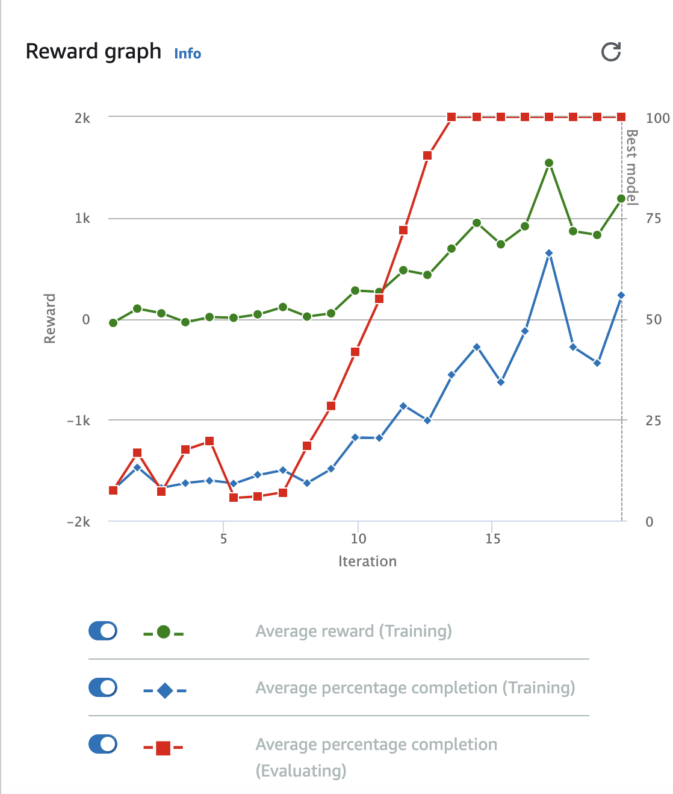
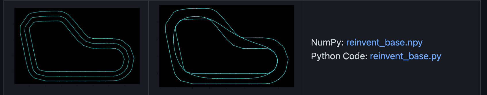

<!-- PROJECT SHIELDS -->

[![Contributors][contributors-shield]][contributors-url]
[![Issues][issues-shield]][issues-url]
[![MIT License][license-shield]][license-url]
[![LinkedIn][linkedin-shield]][linkedin-url]

<!-- AWS PROJECT LOGO -->
 

  

<h3 align="center">AWS DeepRacer UNSW 2023</h3>

  

    An AWS DeepRacer Competition
     
    <a href="https://github.com/Lunagaron/UNSW_DeepRacer"><strong>Explore the docs »</strong></a>
     
     
    <a href="https://github.com/Lunagaron/UNSW_DeepRacer">View Demo</a>
    ·
    <a href="https://github.com/Lunagaron/UNSW_DeepRacer/issues">Report Bug</a>
    ·
    <a href="https://github.com/Lunagaron/UNSW_DeepRacer/issues">Request Feature</a>
  

<!-- TABLE OF CONTENTS -->

  
Table of Contents

  <ol>
    <li>
      <a href="#about-the-project">About The Project</a>
      <ul>
        <li><a href="#results">Results</a></li>
      </ul>
    </li>
    <li>
      <a href="#development">Development</a>
      <ul>
        <li><a href="#hyperparameters">Hyperparameters</a></li>
        <li><a href="#actionspace">Action Space</a></li>
        <li><a href="#rewardfunction">Reward Function</a></li>
      </ul>
    </li>
    <li><a href="#contact">Conclusion</a></li>
    <li><a href="#acknowledgments">Acknowledgments</a></li>
  </ol>

<!-- ABOUT THE PROJECT -->

## About The Project

  

 

This repository presents a comprehensive overview of the strategy and techniques employed for the AWS DeepRacer event hosted at UNSW in May 2023. The race served as an immersive demonstration experience, showcasing the seamless integration of cloud technology into the future of higher education. It was organized as part of the UNSW and AWS Presents: Innovation in Higher Education Seminar.

### Built With

- [![Python][Python.shield]][Python.url]
- [![NumPy][NumPy.shield]][NumPy.url]
- [![AWS][AWS.shield]][AWS.url]

### Results

#### Re:Invent 2018 Circuit Virtual Race (1st Place)

  

#### Re:Invent 2018 Circuit In-Person Race (TBD Place)

(<a href="#readme-top">back to top</a>)

<!-- GETTING STARTED -->

## Development

The 2023 AWS DeepRacer challenge held at UNSW utilised the 2018 re:Invent circuit which is a relatively simple circuit with predominanently left hand turns.

  

### Hyperparameters

Tuning the hyperparameters of the neural network in AWS DeepRacer was crucial to ensure the model's convergence to an optimal and stable state. DeepRacer utilizes advanced reinforcement learning techniques, with the neural network being a key component of the learning algorithm.

During the training process, the model underwent iterative updates using a technique known as backpropagation. This technique allowed the neural network to adjust its internal weights and biases based on the calculated error between predicted and actual outputs. By propagating this error back through the network, the model fine-tuned its parameters and improved its performance over time.

In addition to backpropagation, AWS DeepRacer leveraged machine learning principles to facilitate the learning process. Reinforcement learning, a subfield of machine learning, enables the model to learn from interactions with its environment and make decisions that maximize a predefined reward signal. By repeatedly exposing the model to the racing environment and optimizing its actions based on rewards and penalties, the neural network learned effective racing strategies.

To prevent overfitting, which can hinder the generalization of the learned policies, training sessions were limited to a maximum duration of one hour. Overfitting occurs when the model becomes too specialized in the training data, leading to poor performance on new and unseen scenarios. By constraining the training time, AWS DeepRacer sought to strike a balance between capturing important racing patterns and avoiding overfitting, thereby promoting better generalization.

Throughout the training process, the primary objective was to ensure that the model was capable of completing 100% of the track without any of the wheels deviating beyond the circuit boundaries. This criterion ensured that the learned policies resulted in safe and successful racing maneuvers.

The final output of the training represented the culmination of these efforts—an optimized and high-performing model that could successfully navigate the track while adhering to the defined circuit boundaries.

  

(<a href="#readme-top">back to top</a>)

### Action Space

The action space in AWS DeepRacer defines the range of actions available for the model to control its movement during the racing simulation. It is typically discrete, meaning the model selects actions from a predefined set of options, such as different steering angles and acceleration levels. The specific configuration of the action space depends on the chosen racing circuit, like the re:Invent 2018 track for the UNSW DeepRacer qualifiers, which features a simple loop circuit with one sharp left turn and two straightforward left turns.

During its training, the model explores various actions in different states and receives feedback in the form of rewards or penalties. This feedback helps the model learn which actions lead to better outcomes and encourages it to prioritize actions with higher rewards or lower penalties. The reward function was customised based on the calculated optimal racing line in [cdthompson's Github Repository](https://github.com/cdthompson/deepracer-k1999-race-lines), which provides an optimal racing line and angles derived from Remi Coulom's PhD Thesis, K1999 Path-Optimization Algorithm.

  

By refining the action space, the model can learn effective racing strategies and adapt to track conditions and the environment. The goal is to strike a balance between exploration and exploitation, allowing the model to explore new actions while leveraging knowledge from previous experiences to make informed decisions.

Designing an appropriate action space is crucial for training an AWS DeepRacer model as it directly influences behavior, performance, and the ability to successfully complete the racing track.

(<a href="#readme-top">back to top</a>)

### Reward Function

Use this space to show useful examples of how a project can be used. Additional screenshots, code examples and demos work well in this space. You may also link to more resources.

_For more examples, please refer to the [Documentation](https://example.com)_

(<a href="#readme-top">back to top</a>)

<!-- ROADMAP -->

## Conclusion

See the [open issues](https://github.com/github_username/repo_name/issues) for a full list of proposed features (and known issues).

(<a href="#readme-top">back to top</a>)

## Acknowledgments

- 
- 
- 

(<a href="#readme-top">back to top</a>)

<!-- Shields -->

[contributors-shield]: https://img.shields.io/github/contributors/Lunagaron/UNSW_DeepRacer.svg?style=for-the-badge
[contributors-url]: https://github.com/Lunagaron/UNSW_DeepRacer/graphs/contributors
[issues-shield]: https://img.shields.io/github/issues/Lunagaron/UNSW_DeepRacer.svg?style=for-the-badge
[issues-url]: https://github.com/Lunagaron/UNSW_DeepRacer/issues
[license-shield]: https://img.shields.io/github/license/Lunagaron/UNSW_DeepRacer.svg?style=for-the-badge
[license-url]: https://github.com/Lunagaron/UNSW_DeepRacer/blob/master/LICENSE.txt
[linkedin-shield]: https://img.shields.io/badge/-LinkedIn-black.svg?style=for-the-badge&logo=linkedin&colorB=555
[linkedin-url]: https://linkedin.com/in/hongliang0
[Python.shield]: https://img.shields.io/badge/-Python-3776AB?style=for-the-badge&logo=python&logoColor=white
[Python.url]: https://www.python.org/
[NumPy.shield]: https://img.shields.io/badge/-NumPy-013243?style=for-the-badge&logo=numpy&logoColor=white
[NumPy.url]: https://numpy.org/
[AWS.shield]: https://img.shields.io/badge/-AWS-232F3E?style=for-the-badge&logo=amazonaws&logoColor=white
[AWS.url]: https://aws.amazon.com/
