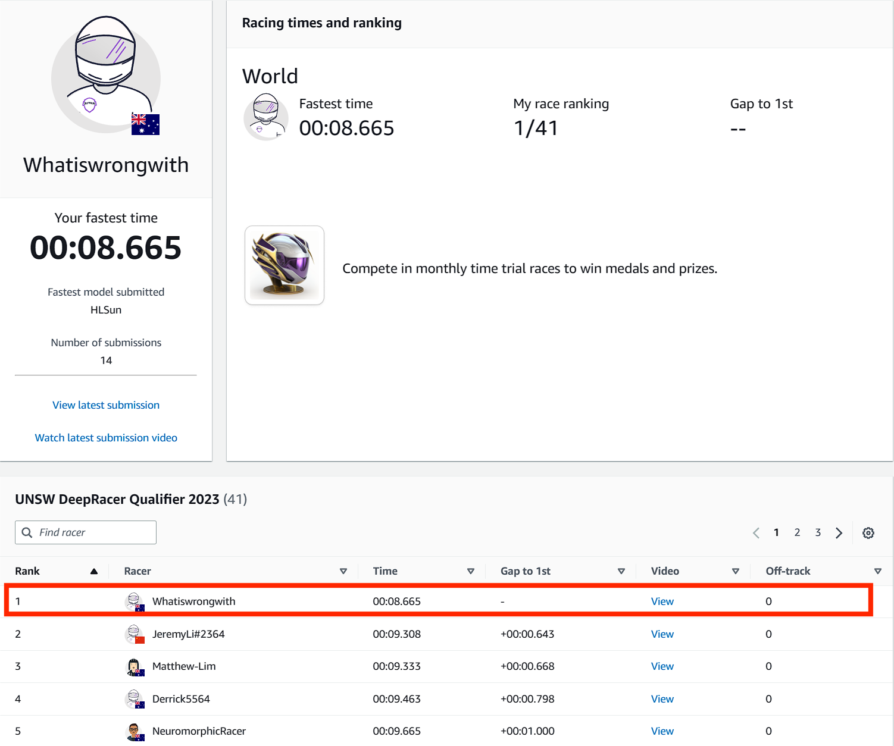
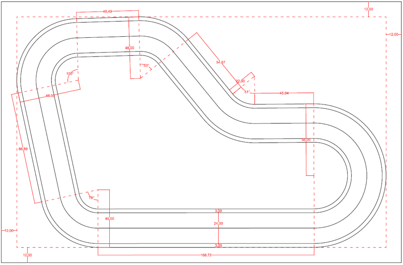

<a name="readme-top"></a>

<!-- PROJECT SHIELDS -->

[![Contributors][contributors-shield]][contributors-url]
[![Issues][issues-shield]][issues-url]
[![MIT License][license-shield]][license-url]
[![LinkedIn][linkedin-shield]][linkedin-url]

<!-- AWS PROJECT LOGO -->
<br />
<div align="center">
  <a href="media/deepracerlogo.png">
    
  </a>

<h3 align="center">AWS DeepRacer UNSW 2023</h3>

  <p align="center">
    An AWS DeepRacer Competition
    <br />
    <a href="https://github.com/Lunagaron/UNSW_DeepRacer"><strong>Explore the docs »</strong></a>
    <br />
    <br />
    <a href="https://github.com/Lunagaron/UNSW_DeepRacer">View Demo</a>
    ·
    <a href="https://github.com/Lunagaron/UNSW_DeepRacer/issues">Report Bug</a>
    ·
    <a href="https://github.com/Lunagaron/UNSW_DeepRacer/issues">Request Feature</a>
  </p>
</div>

<!-- TABLE OF CONTENTS -->
<details>
  <summary>Table of Contents</summary>
  <ol>
    <li>
      <a href="#about-the-project">About The Project</a>
      <ul>
        <li><a href="#results">Results</a></li>
      </ul>
    </li>
    <li>
      <a href="#development">Development</a>
      <ul>
        <li><a href="#hyperparameters">Hyperparameters</a></li>
        <li><a href="#actionspace">Action Space</a></li>
        <li><a href="#rewardfunction">Reward Function</a></li>
      </ul>
    </li>
    <li><a href="#contact">Conclusion</a></li>
    <li><a href="#acknowledgments">Acknowledgments</a></li>
  </ol>
</details>

<!-- ABOUT THE PROJECT -->

## About The Project

<div align="center">
  <a href="https://youtu.be/i0_1YNs-BXY">
    
  </a>
</div>

</br>

This repository presents a comprehensive overview of the strategy and techniques employed for the AWS DeepRacer event hosted at UNSW in May 2023. The race served as an immersive demonstration experience, showcasing the seamless integration of cloud technology into the future of higher education. It was organized as part of the UNSW and AWS Presents: Innovation in Higher Education Seminar.

### Built With

- [![Python][Python.shield]][Python.url]
- [![NumPy][NumPy.shield]][NumPy.url]
- [![AWS][AWS.shield]][AWS.url]

### Results

#### Re:Invent 2018 Circuit Virtual Race (1st Place)

<div style="display: flex; justify-content: center; align-items: center; width: 75vw;">
  
</div>

#### Re:Invent 2018 Circuit In-Person Race (TBD Place)

<p align="right">(<a href="#readme-top">back to top</a>)</p>

<!-- GETTING STARTED -->

## Development

The 2023 AWS DeepRacer challenge held at UNSW utilised the 2018 re:Invent circuit which is a relatively simple circuit with predominanently left hand turns.

<div style="display: flex; justify-content: center; align-items: center; width: 75vw;">
  
</div>

### Hyperparameters

This is an example of how to list things you need to use the software and how to install them.

- npm
  ```sh
  npm install npm@latest -g
  ```

### Action Space

1. Get a free API Key at [https://example.com](https://example.com)
2. Clone the repo
   ```sh
   git clone https://github.com/github_username/repo_name.git
   ```
3. Install NPM packages
   ```sh
   npm install
   ```
4. Enter your API in `config.js`
   ```js
   const API_KEY = "ENTER YOUR API";
   ```

<p align="right">(<a href="#readme-top">back to top</a>)</p>

### Reward Function

Use this space to show useful examples of how a project can be used. Additional screenshots, code examples and demos work well in this space. You may also link to more resources.

_For more examples, please refer to the [Documentation](https://example.com)_

<p align="right">(<a href="#readme-top">back to top</a>)</p>

<!-- ROADMAP -->

## Conclusion

- [ ] Feature 1
- [ ] Feature 2
- [ ] Feature 3
  - [ ] Nested Feature

See the [open issues](https://github.com/github_username/repo_name/issues) for a full list of proposed features (and known issues).

<p align="right">(<a href="#readme-top">back to top</a>)</p>

## Acknowledgments

- []()
- []()
- []()

<p align="right">(<a href="#readme-top">back to top</a>)</p>

<!-- Shields -->

[contributors-shield]: https://img.shields.io/github/contributors/Lunagaron/UNSW_DeepRacer.svg?style=for-the-badge
[contributors-url]: https://github.com/Lunagaron/UNSW_DeepRacer/graphs/contributors
[issues-shield]: https://img.shields.io/github/issues/Lunagaron/UNSW_DeepRacer.svg?style=for-the-badge
[issues-url]: https://github.com/Lunagaron/UNSW_DeepRacer/issues
[license-shield]: https://img.shields.io/github/license/Lunagaron/UNSW_DeepRacer.svg?style=for-the-badge
[license-url]: https://github.com/Lunagaron/UNSW_DeepRacer/blob/master/LICENSE.txt
[linkedin-shield]: https://img.shields.io/badge/-LinkedIn-black.svg?style=for-the-badge&logo=linkedin&colorB=555
[linkedin-url]: https://linkedin.com/in/hongliang0
[Python.shield]: https://img.shields.io/badge/-Python-3776AB?style=for-the-badge&logo=python&logoColor=white
[Python.url]: https://www.python.org/
[NumPy.shield]: https://img.shields.io/badge/-NumPy-013243?style=for-the-badge&logo=numpy&logoColor=white
[NumPy.url]: https://numpy.org/
[AWS.shield]: https://img.shields.io/badge/-AWS-232F3E?style=for-the-badge&logo=amazonaws&logoColor=white
[AWS.url]: https://aws.amazon.com/
